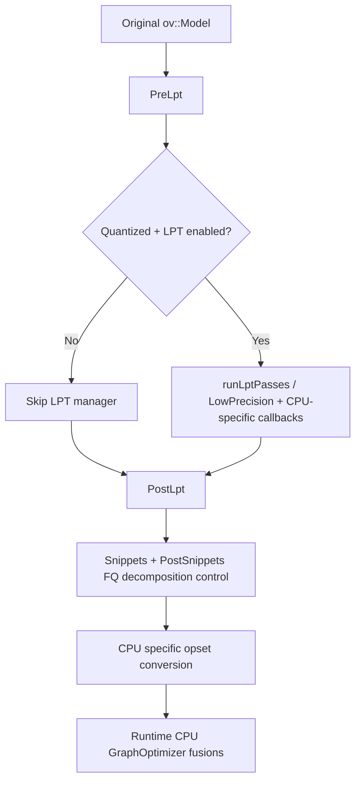

# 01. Overview

## 1. Where LPT sits in CPU plugin flow

Model transformation order in CPU plugin compilation (`src/plugins/intel_cpu/src/plugin.cpp:363-377`):

1. `Transformations::UpToLpt()`
2. `Transformations::PostLpt()`
3. `Transformations::Snippets()`
4. `Transformations::CpuSpecificOpSet()`

Runtime graph-level fusion then happens in CPU graph configure stage (`src/plugins/intel_cpu/src/graph.cpp:410-437`) via:

- `GraphOptimizer::ApplyCommonGraphOptimizations()`
- `GraphOptimizer::ApplyImplSpecificGraphOptimizations()`

## 2. LPT activation conditions

LPT is enabled only when all conditions hold (`src/plugins/intel_cpu/src/transformations/transformation_pipeline.cpp:442-444`):

- `config.lpTransformsMode == On`
- model is quantized for supported FQ levels (`int4/int8` variants)
- debug capability gate for LPT is enabled

If enabled, `defaultPrecisions` is INT8 support set (`transformation_pipeline.cpp:446`), and `Lpt(defaultPrecisions)` is executed (`transformation_pipeline.cpp:450-452`).

## 3. High-level mechanism

## 4. Core technical layers in LPT behavior

### 4.1 Pre-LPT decomposition & precision normalization

- Decompression-specific manager runs before common pre-LPT to preserve compressed MatMul-weight paths (`transformation_pipeline.cpp:464-510`).
- Precision conversion policy is applied with architecture-specific fusing (`transformation_pipeline.cpp:517-557`, `660-665`).
- Plugin-local canonicalization passes prepare ARM/x64 patterns before LPT (for example, `SwapConvertTranspose`, reduce conversions, 1D conv/deconv decompositions, etc.; registration around `transformation_pipeline.cpp:669-687`).

### 4.2 LPT manager execution

- LPT manager is created as `CPU:LPT` (`transformation_pipeline.cpp:921`).
- Pass `LowPrecision` is registered with architecture-dependent precision and quantization restrictions (`transformation_pipeline.cpp:923-973`).
- ARM adds extra low-precision compatibility transforms:
  - `ConvertConvolutionBias` (`transformation_pipeline.cpp:974`)
  - `FallbackUnsupportedLPConvToFP16` (`transformation_pipeline.cpp:975`)
- ARM/x64 callbacks gate individual LPT sub-transforms (`transformation_pipeline.cpp:976-1078`).

### 4.3 Post-LPT specialized fusion

- Post-LPT manager executes final graph canonicalizations plus quantization-aware fusions (`transformation_pipeline.cpp:1095-1207`).
- x64-only quantization/fusion passes include:
  - `FuseFQtoInteraction` (`1128`)
  - `ConvertFqRnnToQuantizedRnn` (`1131`)
  - `MLPFusion` (`1147`) and `QKVProjFusion` (`1161`) under AMX+precision gates (`1140-1145`)

### 4.4 Post-Snippets FakeQuantize finalization

- `FakeQuantizeDecomposition` always registered in post-snippets (`1666`).
- x64 callback keeps supported native FQ (`1667-1673`).
- ARM callback keeps only ACL-convolution-compatible FQ patterns, decomposes others (`1676-1688`).

## 5. Runtime graph optimizer role for low precision

After nGraph pass pipeline, CPU runtime graph optimizer performs executor-facing fusions of quantization subgraphs, including:

- Zero-point folding into convolution (`graph_optimizer.cpp:938-1121`)
- Dequantization scale folding (`260-361`)
- Bias fusion for conv/matmul/deconv (`363-539`)
- FQ parameter folding into parent ops (`2313-2557`)
- Pooling+FQ fusion (`1481-1525`)

This stage is critical because final CPU executors consume fused attributes/post-ops rather than original high-level FQ/DQ subgraphs.

## 6. Cross-check against existing CPU plugin docs

- `src/plugins/intel_cpu/docs/fake_quantize.md:124-255`:
  - The document describes splitting FQ into quantize-only and DQ-like arithmetic and discusses post-op folding.
  - This matches runtime optimizer fusions in `src/plugins/intel_cpu/src/graph_optimizer.cpp:2313-2557` and `src/plugins/intel_cpu/src/graph_optimizer.cpp:1481-1525`.
- `src/plugins/intel_cpu/docs/internal_cpu_plugin_optimization.md:46-71`:
  - Describes Pooling+FQ and Conv+simple-layer fusion at runtime graph level.
  - This matches `FusePoolingAndFakeQuantize` (`graph_optimizer.cpp:1481-1525`) and conv-adjacent fusions in `graph_optimizer.cpp:260-539`.
- `src/plugins/intel_cpu/docs/convolution_post_ops.md:1-64`:
  - Explains legacy/stock post-op and zero-point coexistence and architecture-specific constraints.
  - This is consistent with architecture branches in `FuseConvolutionAndZeroPoints` (`graph_optimizer.cpp:938-1121`) and pass-order differences (`graph_optimizer.cpp:98-117`).
- `src/plugins/intel_cpu/docs/cpu_emulation.md:1-37` and `src/plugins/intel_cpu/docs/compilation_options.md:1-17`:
  - Provide debug/emulation workflows but do not change transformation semantics.
  - They are operationally relevant for reproducing or validating the LPT/fusion behavior documented here.
