# 03. Transformations Catalog (LPT-Related)

This catalog covers CPU-plugin-local transformations that participate directly in the LPT-related path.

## A. Pre-LPT local transformations

### A1. `SDPASubgraphFusion` (model pass)

- File/class/function:
  - `src/plugins/intel_cpu/src/transformations/cpu_opset/common/pass/stateful_sdpa_fusion.hpp:20`
  - `src/plugins/intel_cpu/src/transformations/cpu_opset/common/pass/stateful_sdpa_fusion.cpp:311`
- Registration point:
  - `transformation_pipeline.cpp:574`
- Intent:
  - Collapse stateful SDPA KV-cache read/gather/concat/assign subgraph into CPU SDPA-with-KV-cache op.
- Pattern/conditions:
  - Matcher built in `StatefulSDPAFusion` (`stateful_sdpa_fusion.cpp:54-309`).
  - Validates concat axes, assign variable IDs, child types, optional transpose consistency.
  - Sink-input branch disabled outside x86_64 (`120-124`).
- Rewrite effect:
  - Replace matched `ScaledDotProductAttention` with `ScaledDotProductAttentionWithKVCache` and reconnect Assign inputs (`281-295`).
- Precision/layout implications:
  - Preserves/threads convert nodes around cache paths; supports transpose-based canonicalization when compatible.
- Interactions:
  - Runs inside `SymbolicOptimizations` in this pass (`313-323`); can chain with `SDPAFuseTransposeReshape` on x64 (`320`).
- x64 vs ARM:
  - Pattern exists on all, but sink-input variant is x64-only.

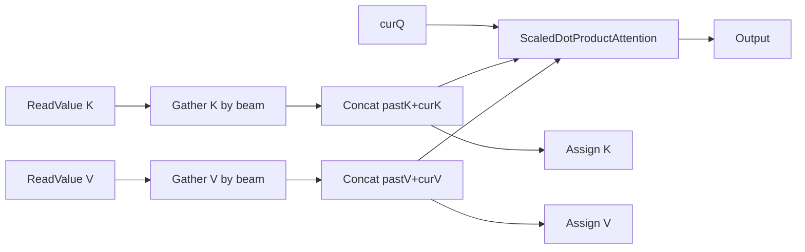

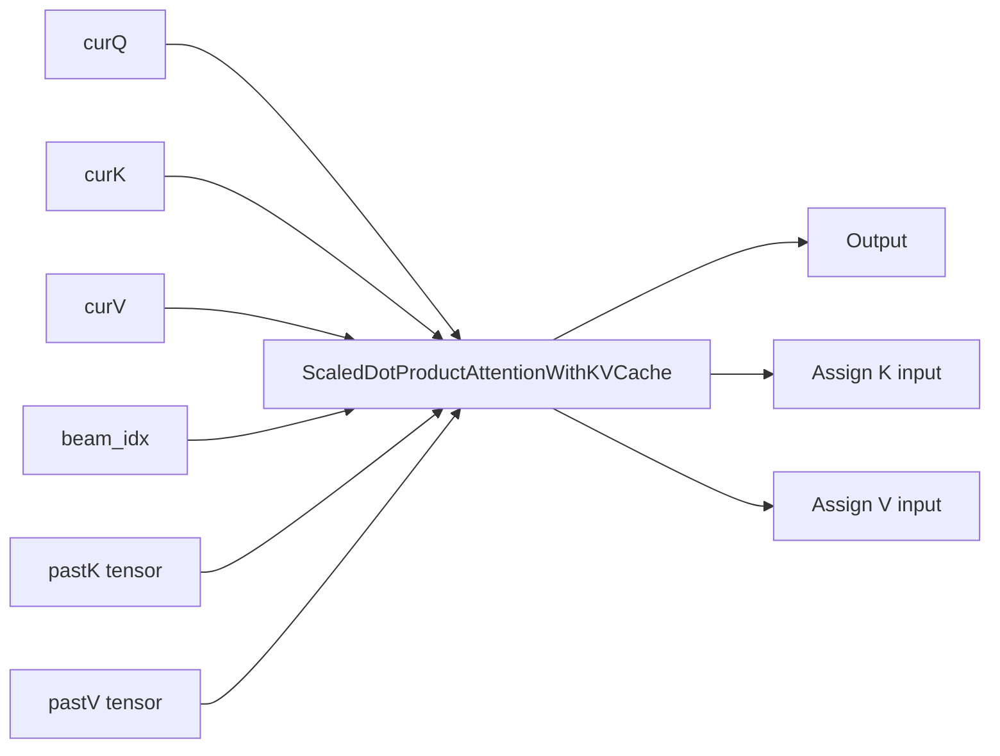

### A2. `InsertConvertAfterExtension`

- File/class/function:
  - `src/plugins/intel_cpu/src/transformations/cpu_opset/common/pass/insert_convert_after_extension.hpp:14`
  - `src/plugins/intel_cpu/src/transformations/cpu_opset/common/pass/insert_convert_after_extension.cpp:23`
- Registration point:
  - `transformation_pipeline.cpp:656`
- Intent:
  - Insert explicit `Convert(i64/u64 -> i32)` after unknown extension ops to keep CPU-supported element types.
- Pattern/conditions:
  - Matches extension outputs with `Type::Unknown` and `i64/u64` (`insert_convert_after_extension.cpp:26-33`).
- Rewrite effect:
  - Adds `Convert` on each affected output except `Result` when `convert_output_precision=false` (`43-48`).
- Precision/layout implications:
  - Normalizes extension output types before global `ConvertPrecision`.
- Interactions:
  - Must execute immediately before `ConvertPrecision` (explicit comment and registration ordering in `transformation_pipeline.cpp:657-665`).
- x64 vs ARM:
  - Common behavior.


### A3. `SwapConvertTranspose`

- File/class/function:
  - `src/plugins/intel_cpu/src/transformations/cpu_opset/common/pass/swap_convert_transpose.hpp:11`
  - `src/plugins/intel_cpu/src/transformations/cpu_opset/common/pass/swap_convert_transpose.cpp:23`
- Registration point:
  - `transformation_pipeline.cpp:669`
- Intent:
  - Move transpose before convert for i8/u8 parameter inputs.
- Pattern/conditions:
  - `Parameter(i8/u8) -> Convert(f32) -> Transpose` and convert has single consumer (`swap_convert_transpose.cpp:25-43`).
- Rewrite effect:
  - Rebuild as `Parameter -> Transpose(i8/u8) -> Convert(f32)` (`45-54`).
- Precision/layout implications:
  - Keeps more graph in low precision before cast; can reduce data movement in fp32.
- Interactions:
  - Runs after `EliminateConvert/EliminateIdentityConvert` in pre-LPT (`transformation_pipeline.cpp:667-669`).
- x64 vs ARM:
  - Common behavior.


### A4. `ConvertReduceNoKeepDims`

- File/class/function:
  - `src/plugins/intel_cpu/src/transformations/cpu_opset/arm/pass/convert_reduce_no_keep_dims.hpp:60`
  - `src/plugins/intel_cpu/src/transformations/cpu_opset/arm/pass/convert_reduce_no_keep_dims.cpp:21`
- Registration point:
  - `transformation_pipeline.cpp:672` (ARM)
- Intent:
  - Convert `Reduce(keep_dims=false)` to `Reduce(keep_dims=true)+Squeeze` for ACL compatibility.
- Pattern/conditions:
  - Matches logical/arithmetic reduce ops with constant axes and `keep_dims=false` (`cpp:23-25`, `41-45`).
- Rewrite effect:
  - Clone reduce with `keep_dims=true` and append `Squeeze` (`28-34`).
- Precision/layout implications:
  - Shape-only rewrite; data type unchanged.
- Interactions:
  - Often paired with `ConvertReduceMultiAxis` in ARM path.
- x64 vs ARM:
  - ARM-only registration.

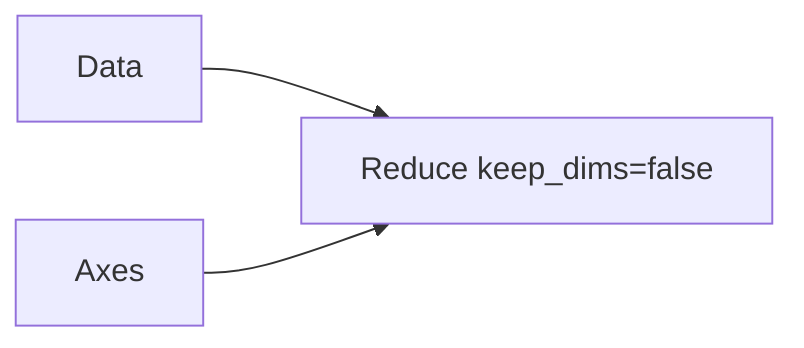

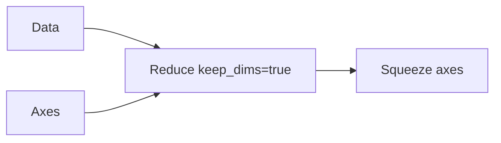

### A5. `ConvertReduceMultiAxis`

- File/class/function:
  - `src/plugins/intel_cpu/src/transformations/cpu_opset/arm/pass/convert_reduce_multi_axis.hpp:83`
  - `src/plugins/intel_cpu/src/transformations/cpu_opset/arm/pass/convert_reduce_multi_axis.cpp:26`
- Registration point:
  - `transformation_pipeline.cpp:673` (ARM)
- Intent:
  - Split unsupported multi-axis reduce into sequence of single-axis reduces.
- Pattern/conditions:
  - Constant axes input with more than one axis (`cpp:36-45`), supported ops: prod/min/max/sum.
  - Reject dynamic reduced dimensions in selected axes (`48-52`).
- Rewrite effect:
  - Builds chain of single-axis reduces; if `keep_dims=false`, axes sorted descending to preserve correctness (`58-67`).
- Precision/layout implications:
  - Type unchanged; graph depth increases.
- Interactions:
  - Complements `ConvertReduceNoKeepDims`.
- x64 vs ARM:
  - ARM-only registration.

```mermaid
flowchart LR
    X[Data] --> R[Reduce axes=[a,b,...]]
```


### A6. `ConvertConv1D` and `ConvertGroupConv1D`

- File/class/function:
  - `src/plugins/intel_cpu/src/transformations/cpu_opset/arm/pass/convert_group_conv1d.hpp:62,68`
  - `src/plugins/intel_cpu/src/transformations/cpu_opset/arm/pass/convert_group_conv1d.cpp:24-91`
- Registration point:
  - `transformation_pipeline.cpp:675-676` (ARM)
- Intent:
  - Re-express 1D conv/group-conv as 2D form using unsqueeze/squeeze wrapper.
- Pattern/conditions:
  - Input rank must be 3 (`convert_group_conv1d.cpp:35-37`).
- Rewrite effect:
  - `Unsqueeze(data,weights)` -> `Conv2D/GroupConv2D` with adjusted strides/pads/dilations -> `Squeeze` (`48-73`).
- Precision/layout implications:
  - Layout rank change only; precision unchanged.
- Interactions:
  - Enables downstream ACL paths that are 2D-oriented.
- x64 vs ARM:
  - ARM-only registration.

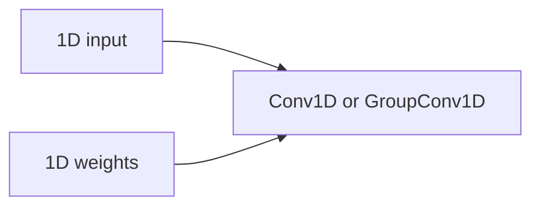

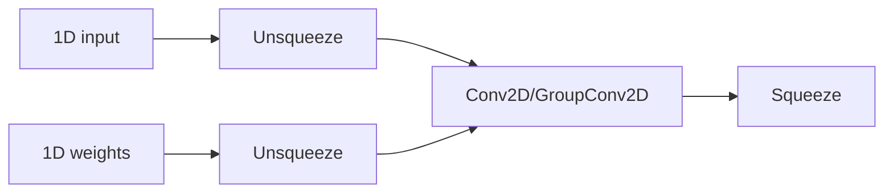

### A7. `ConvertGroupConvolution`

- File/class/function:
  - `src/plugins/intel_cpu/src/transformations/cpu_opset/arm/pass/convert_group_conv.hpp:60`
  - `src/plugins/intel_cpu/src/transformations/cpu_opset/arm/pass/convert_group_conv.cpp:25-88`
- Registration point:
  - `transformation_pipeline.cpp:677` (ARM)
- Intent:
  - Convert non-depthwise GroupConvolution into split-per-group Convolution + concat.
- Pattern/conditions:
  - Rejects dynamic channel dim and depthwise case (`convert_group_conv.cpp:41-49`).
- Rewrite effect:
  - Split weights and data by groups, squeeze weights group dim, run per-group convolutions, concat channels (`51-79`).
- Precision/layout implications:
  - Precision unchanged; decomposition increases node count.
- Interactions:
  - Complements ARM conv canonicalization.
- x64 vs ARM:
  - ARM-only registration.

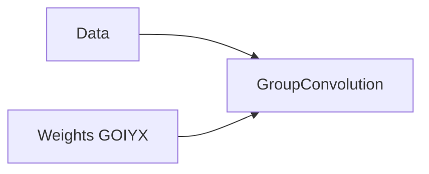

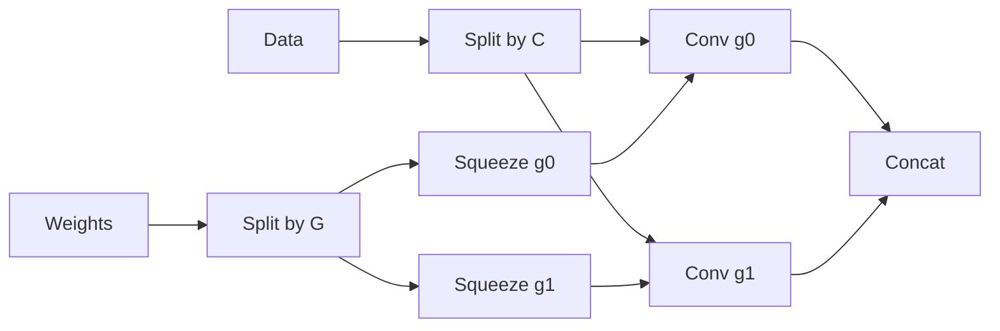

### A8. `GridSampleDecomposition`

- File/class/function:
  - `src/plugins/intel_cpu/src/transformations/cpu_opset/arm/pass/grid_sample_decomposition.hpp:76`
  - `src/plugins/intel_cpu/src/transformations/cpu_opset/arm/pass/grid_sample_decomposition.cpp` (builder and matcher)
- Registration point:
  - `transformation_pipeline.cpp:679` (ARM)
- Intent:
  - Decompose `GridSample` into primitive ops for ARM execution path.
- Pattern/conditions:
  - Handles NEAREST/BILINEAR/BICUBIC with padding modes and align_corners policy; contains special guards for problematic nearest combinations (`grid_sample_decomposition.cpp:113-118`).
- Rewrite effect:
  - Replaces single `GridSample` with coordinate normalization, index generation, gather, and weighted combine subgraph.
- Precision/layout implications:
  - Performs internal f32 math as needed (`to_f32` helper), converts back when required.
- Interactions:
  - Uses symbolic/static folding helpers (`make_try_fold`) so static shapes simplify.
- x64 vs ARM:
  - ARM-only registration.

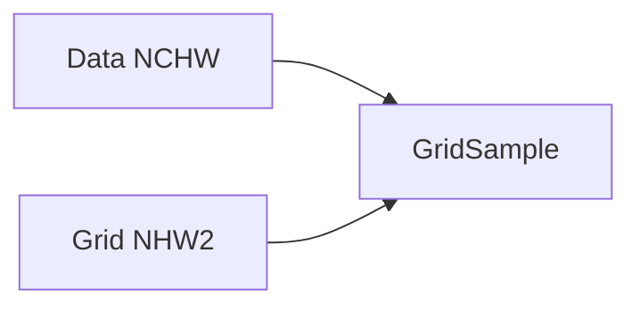

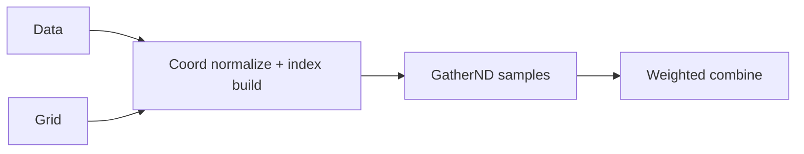

### A9. `Deconv1DDecomposition`

- File/class/function:
  - `src/plugins/intel_cpu/src/transformations/cpu_opset/arm/pass/deconv_1d_decomposition.hpp:73`
  - `src/plugins/intel_cpu/src/transformations/cpu_opset/arm/pass/deconv_1d_decomposition.cpp:48-353`
- Registration point:
  - `transformation_pipeline.cpp:680` (ARM)
- Intent:
  - Rewrite 1D `ConvolutionBackpropData` into explicit upsample/pad/conv/reshape pipeline.
- Pattern/conditions:
  - Input and weights rank must be 3 (1D case) (`49-57`, `66-68`).
  - Handles auto_pad semantics; validates channel consistency (`78-117`).
- Rewrite effect:
  - Builds subgraph including optional scatter-based upsampling (stride>1), dynamic pad computation, weight reshape+transpose, 2D conv, final reshape to 3D (`166-347`).
- Precision/layout implications:
  - Structural decomposition; precision propagated from original inputs.
- Interactions:
  - Uses `make_try_fold` heavily for shape/value folding.
- x64 vs ARM:
  - ARM-only registration.


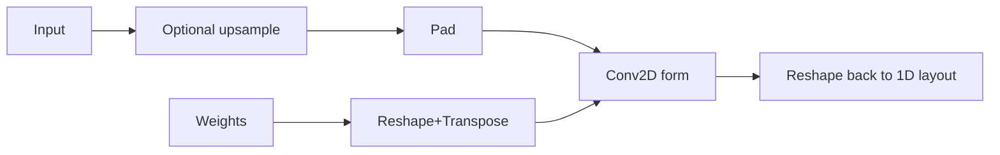

### A10. `MishDecomposition`

- File/class/function:
  - `src/plugins/intel_cpu/src/transformations/cpu_opset/arm/pass/mish_decomposition.hpp:10`
  - `src/plugins/intel_cpu/src/transformations/cpu_opset/arm/pass/mish_decomposition.cpp:22-47`
- Registration point:
  - `transformation_pipeline.cpp:674` (ARM32 only)
- Intent:
  - Replace Mish with primitive equivalent.
- Pattern/conditions:
  - Matches `ov::op::v4::Mish`.
- Rewrite effect:
  - `x * tanh(log(exp(x)+1))` (`31-41`).
- Precision/layout implications:
  - Type preserved from original op output type.
- Interactions:
  - Runs in ARM32 canonicalization block.
- x64 vs ARM:
  - ARM32 only.


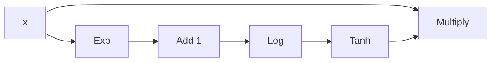

### A11. `DecomposeIntegerDivide`

- File/class/function:
  - `src/plugins/intel_cpu/src/transformations/cpu_opset/common/pass/decompose_integer_divide.hpp:10`
  - `src/plugins/intel_cpu/src/transformations/cpu_opset/common/pass/decompose_integer_divide.cpp:18-38`
- Registration point:
  - ARM: `transformation_pipeline.cpp:683`
  - x86: `transformation_pipeline.cpp:684`
- Intent:
  - Preserve integer divide semantics when backend computes divide in floating point.
- Pattern/conditions:
  - Match `Divide` with integral output type (`26-27`).
- Rewrite effect:
  - Replace with `Floor(Divide)` (`30-35`).
- Precision/layout implications:
  - Enforces deterministic integer-like behavior after FP divide.
- Interactions:
  - Commented in pipeline around `681-684`.
- x64 vs ARM:
  - Enabled on ARM and x86-family.

```mermaid
flowchart LR
    A[a] --> D[Divide]
    B[b] --> D
```

```mermaid
flowchart LR
    A[a] --> D[Divide]
    B[b] --> D
    D --> F[Floor]
```

### A12. `PermuteSliceAndInterpolation`

- File/class/function:
  - `src/plugins/intel_cpu/src/transformations/cpu_opset/common/pass/permute_slice_n_interpolation.hpp:14`
  - `src/plugins/intel_cpu/src/transformations/cpu_opset/common/pass/permute_slice_n_interpolation.cpp:30-98`
- Registration point:
  - `transformation_pipeline.cpp:686`
- Intent:
  - Reorder `Slice->Transpose->Interpolate` to reduce expensive interpolate-on-transposed-data path for int8/u8 inputs.
- Pattern/conditions:
  - Parameter i8/u8, specific slice axis (last axis), specific transpose orders (`61-70`).
- Rewrite effect:
  - Build `Transpose` directly from original input, run interpolate before slice rewrite, then adjusted slice on axis 1 (`73-90`).
- Precision/layout implications:
  - Keeps low-precision data path while changing op order.
- Interactions:
  - Runs after ARM/x64 canonicalization and before validate.
- x64 vs ARM:
  - Common registration.

```mermaid
flowchart LR
    X[i8/u8] --> S[Slice last axis]
    S --> T[Transpose NHWC<->NCHW-like]
    T --> I[Interpolate]
```

```mermaid
flowchart LR
    X[i8/u8] --> T[Transpose]
    T --> I[Interpolate]
    I --> S[Adjusted Slice axis=1]
```

### A13. `ConvertToInteraction`

- File/class/function:
  - `src/plugins/intel_cpu/src/transformations/cpu_opset/x64/pass/convert_to_interaction.hpp:11`
  - `src/plugins/intel_cpu/src/transformations/cpu_opset/x64/pass/convert_to_interaction.cpp:35-99`
- Registration point:
  - `transformation_pipeline.cpp:670` (x64)
- Intent:
  - Fuse DLRM-style feature interaction pattern into `InteractionNode`.
- Pattern/conditions:
  - 27-feature concat + reshape + matmul + gather + final concat topology.
  - Requires compatible feature shapes (`74-80`).
- Rewrite effect:
  - Replace final concat with `InteractionNode`; disconnect original feature consumers (`84-91`).
- Precision/layout implications:
  - Structural fusion, keeps data type semantics of matched pattern.
- Interactions:
  - Post-LPT has optional `FuseFQtoInteraction` for additional quantized optimization.
- x64 vs ARM:
  - x64-only.

```mermaid
flowchart LR
    F[Dense+26 sparse features] --> C[Concat]
    C --> R[Reshape]
    R --> M[MatMul self-interaction]
    M --> G[Gather triangular terms]
    G --> O[Concat with dense]
```

```mermaid
flowchart LR
    F[Dense+26 sparse features] --> I[InteractionNode]
```

### A14. `ConvertInteractionInt8`

- File/class/function:
  - `src/plugins/intel_cpu/src/transformations/cpu_opset/x64/pass/convert_to_interaction.hpp:23`
  - `src/plugins/intel_cpu/src/transformations/cpu_opset/x64/pass/convert_to_interaction.cpp:144-224`
- Registration point:
  - `transformation_pipeline.cpp:671` (x64)
- Intent:
  - Fuse interaction pattern variant containing FQ on dense and sparse branches with aligned FQ constants.
- Pattern/conditions:
  - Requires same shape among feature inputs and same FQ parameters on dense/sparse paths (`184-207`).
- Rewrite effect:
  - Replace final concat with `FakeQuantize(InteractionNode(...))` (`210-219`).
- Precision/layout implications:
  - Preserves explicit FQ semantics while fusing interaction compute.
- Interactions:
  - Complements `ConvertToInteraction`; post-LPT may simplify/remap FQ.
- x64 vs ARM:
  - x64-only.

```mermaid
flowchart LR
    D[Dense FQ] --> P[Interaction subgraph]
    S[Sparse + sparse FQ] --> P
    P --> O[Final concat]
```

```mermaid
flowchart LR
    F[Features] --> I[InteractionNode]
    I --> FQ[FakeQuantize]
```

## B. LPT manager local transforms (ARM)

### B1. `ConvertConvolutionBias`

- File/class/function:
  - `src/plugins/intel_cpu/src/transformations/cpu_opset/arm/pass/convert_conv_bias.hpp:88`
  - `src/plugins/intel_cpu/src/transformations/cpu_opset/arm/pass/convert_conv_bias.cpp:30-81`
- Registration point:
  - `transformation_pipeline.cpp:974`
- Intent:
  - For quantized `Conv->Mul->Add->FQ`, enforce ACL-compatible bias path (`i32`) and reorder to `Conv->Add->Mul->FQ`.
- Pattern/conditions:
  - Matched by `ConvMulAddFQBlock(require_int_fq_output=true)` (`convert_conv_bias.cpp:31`).
  - FQ output type must equal convolution activation type (`51-53`).
- Rewrite effect:
  - Swap mul/add via `NetworkHelper::swapMultiplyAndAdd` (`54-57`).
  - Mark new multiply as dequantization node (`59-60`).
  - Insert `Round` + `Convert(i32)` on bias and rebuild add (`63-75`).
- Precision/layout implications:
  - Bias forced to i32 for ACL low-precision executor path.
- Interactions:
  - Depends on `ConvMulAddFQBlock` anchors.
  - Works with later ARM FQ-decomposition callback logic in `PostSnippets`.
- x64 vs ARM:
  - ARM-only.

```mermaid
flowchart LR
    X[i8/u8] --> C[Convolution]
    W[i8] --> C
    C --> M[Multiply]
    B[Bias const] --> A[Add]
    M --> A
    A --> FQ[FakeQuantize]
```

```mermaid
flowchart LR
    X[i8/u8] --> C[Convolution]
    W[i8] --> C
    B[Bias const] --> R[Round]
    R --> CVT[Convert i32]
    C --> A[Add]
    CVT --> A
    A --> M[Multiply]
    M --> FQ[FakeQuantize]
```

### B2. `FallbackUnsupportedLPConvToFP16`

- File/class/function:
  - `src/plugins/intel_cpu/src/transformations/cpu_opset/arm/pass/fallback_unsupported_lp_conv_to_fp16.hpp:85`
  - `src/plugins/intel_cpu/src/transformations/cpu_opset/arm/pass/fallback_unsupported_lp_conv_to_fp16.cpp:51-122`
- Registration point:
  - `transformation_pipeline.cpp:975`
- Intent:
  - For unsupported ACL int8 conv case (FQ output precision mismatch), move post-conv DQ scale into weights and run FP16-friendly path.
- Pattern/conditions:
  - Match `Conv->Mul->Add->FQ` by `ConvMulAddFQBlock(require_int_fq_output=false)` (`52`).
  - Trigger only when `FQ output type != Conv input type` (`72-74`).
- Rewrite effect:
  - Insert optional `Convert(f16)` for activation/weights/scales (`36-47`, `78-85`).
  - Reshape scales to weights shape and multiply weights (`86-93`).
  - Clone convolution with scaled weights and replace original mul node (`94-108`).
- Precision/layout implications:
  - Shifts scaling earlier to reduce overflow risk in output path; keeps matched path in FP16 (`109-115`).
- Interactions:
  - Works with preceding/paired `ConvertConvolutionBias` and ARM FakeQuantize callbacks.
- x64 vs ARM:
  - ARM-only.

```mermaid
flowchart LR
    X[q act] --> C[Conv]
    W[q weights] --> C
    C --> M[Multiply DQ scale]
    M --> A[Add bias]
    A --> FQ[FakeQuantize]
```

```mermaid
flowchart LR
    X --> CX[Convert f16]
    W --> CW[Convert f16]
    S[DQ scales] --> CS[Convert f16]
    CS --> RS[Reshape to weight dims]
    CW --> WM[Mul scaled weights]
    RS --> WM
    CX --> C2[Conv with scaled weights]
    WM --> C2
    C2 --> A[Add]
    A --> FQ[FakeQuantize]
```

### B3. LPT callback matcher utilities

- File/functions:
  - `src/plugins/intel_cpu/src/transformations/utils.hpp:23-38`
  - `src/plugins/intel_cpu/src/transformations/utils.cpp:33-122`
- Registration usage:
  - `transformation_pipeline.cpp:976-999`, `1027-1037`, `1676-1688`
- Intent:
  - Provide precise pattern/shape/type guards for ARM low-precision callbacks.
- Key helpers:
  - `match_conv_mul_add_fq<T>`: detect `Conv->Mul->Add->FQ->T` with i8/u8 and same-type constraint (`33-53`).
  - `match_fq_mul_conv_bias_same_types`: verify `FQ` output type matches conv input for specific pattern ordering (`60-81`).
  - `match_conv_fq_same_types`: verify `Conv->FQ` same type (`83-95`).
  - `match_conv_stride_oc_ic_limit`: stride/kernel/channel-limit guard (`97-113`).
- Precision/layout implications:
  - These checks decide whether FQ stays fused or gets decomposed.

```mermaid
flowchart LR
    C[Conv] --> M[Mul]
    M --> A[Add]
    A --> FQ[FakeQuantize]
    FQ --> N[Next op]
```

## C. Post-LPT local transformations

### C1. `FuseFQtoInteraction`

- File/class/function:
  - `src/plugins/intel_cpu/src/transformations/cpu_opset/x64/pass/convert_to_interaction.hpp:17`
  - `src/plugins/intel_cpu/src/transformations/cpu_opset/x64/pass/convert_to_interaction.cpp:101-142`
- Registration point:
  - `transformation_pipeline.cpp:1128` (x64)
- Intent:
  - Absorb compatible output FQ into `InteractionNode` as scale metadata.
- Pattern/conditions:
  - Match `InteractionNode -> FakeQuantize` with constant ranges.
  - `simplifyToScale` must succeed (`121-124`, helper in `simplify_fakequantize.hpp:18-110`).
- Rewrite effect:
  - Remove explicit FQ output and store scales in interaction node (`125-137`).
- Precision/layout implications:
  - Keeps quantized output type on replacement interaction node.
- x64 vs ARM:
  - x64-only.

```mermaid
flowchart LR
    I[InteractionNode] --> FQ[FakeQuantize]
```

```mermaid
flowchart LR
    I2[InteractionNode with fq_scales + output type] --> O[Consumers]
```

### C2. `ConvertFqRnnToQuantizedRnn`

- File/class/function:
  - `src/plugins/intel_cpu/src/transformations/cpu_opset/common/pass/convert_fq_rnn_to_quantized_rnn.hpp:76`
  - `src/plugins/intel_cpu/src/transformations/cpu_opset/common/pass/convert_fq_rnn_to_quantized_rnn.cpp:34-259`
- Registration point:
  - `transformation_pipeline.cpp:1131` (x64)
- Intent:
  - Convert dequantized RNN/LSTM/GRU sequence pattern into quantized TypeRelaxed sequence op with runtime quantization params.
- Pattern/conditions:
  - Detects deq-on-X/H and deq-on-W/R chains into sequence op (`37-83`).
  - Skips i8 hidden-state LSTM path (keeps f32) (`105-119`).
- Rewrite effect:
  - Rebuilds sequence as `TypeRelaxed<...Sequence>` and writes `inputScale`, `weightsScales`, optional `inputShift` into rt_info (`207-221`).
  - Re-inserts H-output dequantization when needed (`228-252`).
- Precision/layout implications:
  - Keeps compute path optimized for quantized runtime while preserving external contract.
- x64 vs ARM:
  - Registered only on x64 in post-LPT.

```mermaid
flowchart LR
    Xq[u8/i8] --> DQX[deq]
    Hq[u8/i8 or const] --> DQH[deq]
    Wq[i8] --> DQW[deq]
    Rq[i8] --> DQR[deq]
    DQX --> RNN[LSTM/GRU Sequence f32]
    DQH --> RNN
    DQW --> RNN
    DQR --> RNN
```

```mermaid
flowchart LR
    Xq[u8/i8] --> QRNN[TypeRelaxed Quantized Sequence]
    Hq --> QRNN
    Wq --> QRNN
    Rq --> QRNN
    QRNN --> Y[Outputs]
    QRNN -. rt_info:inputScale/weightsScales .-> Y
```

### C3. `CausalMaskPreprocessFusion`

- File/class/function:
  - `src/plugins/intel_cpu/src/transformations/cpu_opset/common/pass/causal_mask_preprocess_fusion.hpp:12`
  - `src/plugins/intel_cpu/src/transformations/cpu_opset/common/pass/causal_mask_preprocess_fusion.cpp:248-257`
- Registration point:
  - `transformation_pipeline.cpp:1136` (x64)
- Intent:
  - Fuse complex causal-mask preprocessing subgraph into CPU custom `CausalMaskPreprocessNode`.
- Pattern/conditions:
  - Internal matcher `CausalMaskPreprocess` validates triangular mask constant identity/shape/value and attention-mask wiring (`113-246`).
- Rewrite effect:
  - Replace matched gather output with `CausalMaskPreprocessNode` (`233-241`).
- Precision/layout implications:
  - Produces SDPA-ready mask tensor; avoids repeated generic tensor ops.
- x64 vs ARM:
  - Registered only on x64 in post-LPT.

```mermaid
flowchart LR
    T[Triu mask const + tile/reshape/scatter/select graph] --> G[Gather by cache pos]
    AM[attention_mask] --> T
```

```mermaid
flowchart LR
    AM[attention_mask] --> C[ CausalMaskPreprocessNode ]
    BS[batch_size] --> C
    CP[cache_positions] --> C
    KV[kvLen] --> C
```

### C4. `MLPFusion` (`MLPFusionPass`)

- File/class/function:
  - `src/plugins/intel_cpu/src/transformations/cpu_opset/x64/pass/mlp_fusion.hpp:12-23`
  - `src/plugins/intel_cpu/src/transformations/cpu_opset/x64/pass/mlp_fusion.cpp:37-46`, `48-308`
- Registration point:
  - `transformation_pipeline.cpp:1147` + callback on `MLPFusionPass` (`1148-1154`)
- Intent:
  - Fuse LLM MLP blocks (`gate/up/down` matmuls with SiLU/GELU and multiply) into `LLMMLPNode`.
- Pattern/conditions:
  - Supports multiple weight encodings: fp32/f16 compressed and int8 dequantized variants.
  - Enforces shape consistency and hidden/up/down relation (`205-238`).
- Rewrite effect:
  - Replace full MLP subgraph with `LLMMLPNode` with config and optional dequant scales (`266-303`).
- Precision/layout implications:
  - Encodes quantization mode in node config (`243-248`), keeps mixed quantized/non-quantized support.
- Interactions:
  - Enabled only when AMX+precision gate passes (`transformation_pipeline.cpp:1140-1145`).
- x64 vs ARM:
  - x64-only.

```mermaid
flowchart LR
    X --> G[MatMul gate]
    X --> U[MatMul up]
    G --> ACT[SiLU/GELU]
    ACT --> MUL[Multiply]
    U --> MUL
    MUL --> D[MatMul down]
```

```mermaid
flowchart LR
    X --> MLP[LLMMLPNode]
    WG[gate weights/scales] --> MLP
    WU[up weights/scales] --> MLP
    WD[down weights/scales] --> MLP
```

### C5. `QKVProjFusion` (`QKVProjFusionPass1/Pass2`)

- File/class/function:
  - `src/plugins/intel_cpu/src/transformations/cpu_opset/x64/pass/qkv_proj_fusion.hpp:11-28`
  - `src/plugins/intel_cpu/src/transformations/cpu_opset/x64/pass/qkv_proj_fusion.cpp:36-308`
- Registration point:
  - `transformation_pipeline.cpp:1161` + callbacks for pass1/pass2 (`1163-1182`)
- Intent:
  - Fuse Q/K/V projection matmuls into `QKVProjectionNode`.
- Pattern/conditions:
  - Pass1: three sibling matmuls from same input (`39-188`).
  - Pass2: single combined matmul + `VariadicSplit` (`190-296`).
  - Supports int8-dequantized or non-quantized weights.
- Rewrite effect:
  - Replace projection subgraph outputs with multi-output `QKVProjectionNode` (`166-183`, `271-290`).
- Precision/layout implications:
  - Quantized mode recorded in config and optional scales appended (`159-165`, `257-263`).
- Interactions:
  - Controlled by AMX/precision + support callback in post-LPT.
- x64 vs ARM:
  - x64-only.

```mermaid
flowchart LR
    X --> Q[MatMul Q]
    X --> K[MatMul K]
    X --> V[MatMul V]
```

```mermaid
flowchart LR
    X --> QKV[QKVProjectionNode]
    WQ[Q weights/scales] --> QKV
    WK[K weights/scales] --> QKV
    WV[V weights/scales] --> QKV
    QKV --> OQ[Q]
    QKV --> OK[K]
    QKV --> OV[V]
```

### C6. `DecomposeRMSNorm`

- File/class/function:
  - `src/plugins/intel_cpu/src/transformations/cpu_opset/common/pass/decompose_rms_norm.hpp:10`
  - `src/plugins/intel_cpu/src/transformations/cpu_opset/common/pass/decompose_rms_norm.cpp:27-60`
- Registration point:
  - `transformation_pipeline.cpp:1187` (x64)
- Intent:
  - Decompose internal RMS op to primitive sequence when native `RMSNorm` plugin support callback rejects.
- Pattern/conditions:
  - Matches `ov::op::internal::RMS`; guarded by transformation callback (`31-37`).
- Rewrite effect:
  - Builds `Power -> ReduceMean -> Add(eps) -> Sqrt -> reciprocal(power -1) -> Mul -> Mul(scale)` (`42-54`).
- Precision/layout implications:
  - Uses original input precision for constants.
- Interactions:
  - Post-LPT registers both `RMSFusion` and this decomposition (`1186-1194`).
- x64 vs ARM:
  - x64 registration.

```mermaid
flowchart LR
    X --> R[RMS internal]
    S[Scale] --> R
```

```mermaid
flowchart LR
    X --> P[Power 2]
    P --> M[ReduceMean]
    M --> A[Add eps]
    A --> SQ[Sqrt]
    SQ --> INV[Power -1]
    X --> MUL1[Mul]
    INV --> MUL1
    S --> MUL2[Mul]
    MUL1 --> MUL2
```

### C7. `NgramFusion`

- File/class/function:
  - `src/plugins/intel_cpu/src/transformations/cpu_opset/common/pass/ngram_fusion.hpp:11`
  - `src/plugins/intel_cpu/src/transformations/cpu_opset/common/pass/ngram_fusion.cpp:37-253`
- Registration point:
  - Added into symbolic pipeline in `transformation_pipeline.cpp:1204-1205`
- Intent:
  - Fuse large concat/select/strided-slice ngram construction pattern into `NgramNode`.
- Pattern/conditions:
  - Validates “as-is” branch placement and all select branch bias/index invariants (`49-241`).
- Rewrite effect:
  - Replace concat root with `NgramNode(tokens, indices, k)` (`244-248`).
- Precision/layout implications:
  - Expects tokens f32 and indices i32 patterns.
- x64 vs ARM:
  - Registered in common post-LPT symbolic path.

```mermaid
flowchart LR
    T[Tokens] --> C[Concat of shifted/select branches]
    I[Indices] --> C
```

```mermaid
flowchart LR
    T[Tokens] --> N[NgramNode]
    I[Indices] --> N
```

## D. Post-snippets low-precision control (callbacks)

### D1. `FakeQuantizeDecomposition` callback control

- Registration:
  - Pass registration: `transformation_pipeline.cpp:1666`
- x64 callback:
  - Keep FQ undecomposed when CPU FakeQuantize supports it (`1667-1673`).
- ARM callback:
  - Keep only conv-compatible int8/u8 FQ patterns (`1676-1688`) using:
    - `match_conv_fq_same_types`
    - `match_fq_mul_conv_bias_same_types(..., ConvAddMul)`
- Effect:
  - Final decision point whether explicit `FakeQuantize` survives to runtime graph.

```mermaid
flowchart LR
    FQ[FakeQuantize] --> D[FakeQuantizeDecomposition pass]
```

```mermaid
flowchart LR
    FQ[Supported/Fusible FQ] --> KEEP[Keep as FQ]
    FQ --> DEC[Else decompose to arithmetic ops]
```

