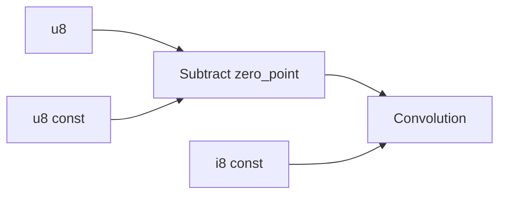
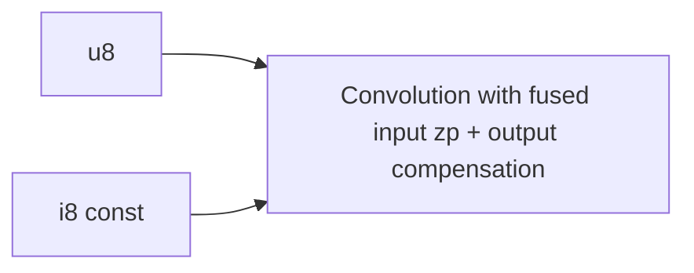
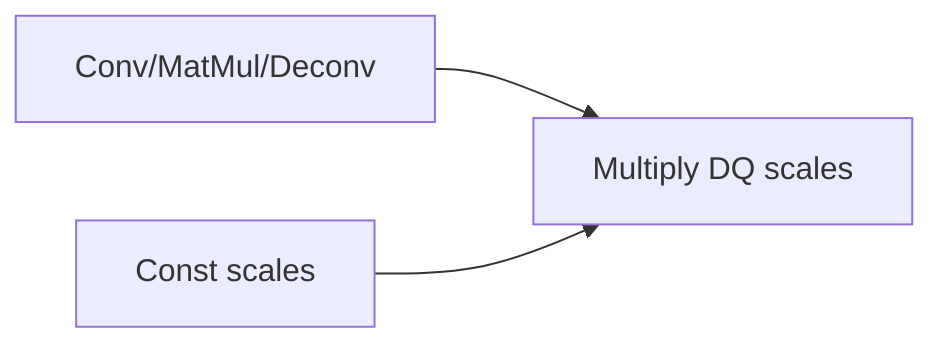
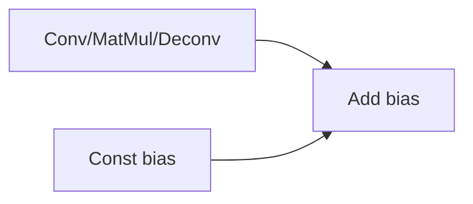
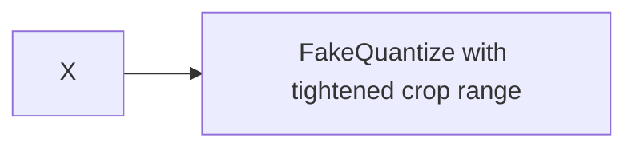
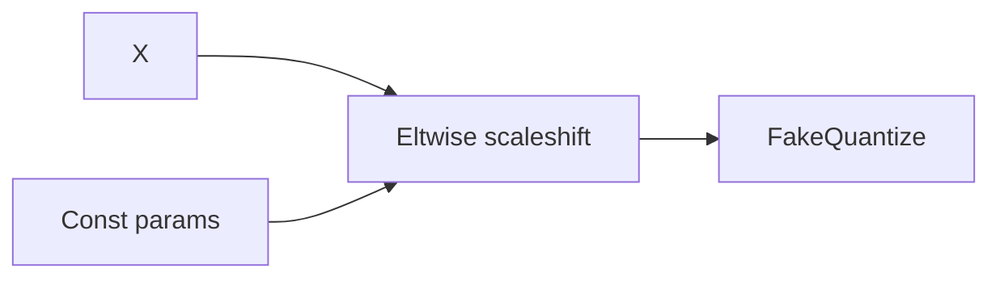
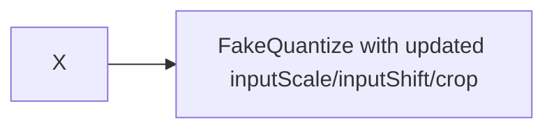

# 04. Graph Optimizer Integration

This section documents CPU runtime graph transformations that directly shape low-precision/FQ execution after nGraph passes.

## 1. Invocation point and order

- Called from `Graph::Configure()` (`src/plugins/intel_cpu/src/graph.cpp:416`) before primitive descriptor initialization.
- Main sequence is in `src/plugins/intel_cpu/src/graph_optimizer.cpp:86-240`.

Low-precision/FQ-sensitive order in `ApplyCommonGraphOptimizations`:

1. `FuseConvolutionAndZeroPoints` (`95`)
2. `FuseConvMatmulFCDeconvAndDQScales` + `FuseConvolutionMatMulDeconvAndBias` with ARM/x86 order split (`98-117`)
3. `FuseClampAndFakeQuantize` (`138-140`)
4. `FusePerformedAsScaleShiftAndFakeQuantize` (`142-144`)
5. `FusePoolingAndFakeQuantize` (`158-160`)

## 2. `FuseConvolutionAndZeroPoints`

- Function: `src/plugins/intel_cpu/src/graph_optimizer.cpp:938-1121`
- Intent:
  - Fold input zero-point subtract into convolution legacy zero-point fields and precompute output compensation.
- Key guards:
  - Disabled on ARM/ARM64 (`940-943`).
  - Conv-only; depthwise+3D restriction (`945-953`).
  - Requires data path `Subtract` with constant u8 zp and i8 weights path (`969-1008`, `979-981`, `997-999`).
- Rewrite:
  - Remove zp constant edge and subtract node; initialize legacy zp/compensation in convolution (`1034-1035`, `1110-1119`).
- Precision impact:
  - Enables integer conv path using fused zero-point metadata.





## 3. `FuseConvMatmulFCDeconvAndDQScales`

- Function: `src/plugins/intel_cpu/src/graph_optimizer.cpp:260-361`
- Intent:
  - Fold trailing dequantization scale multiply into parent conv/matmul/deconv node attributes.
- Key guards:
  - Pattern: `Parent(Conv/MatMul/Deconv) -> Multiply(const scales)` (`263-274`).
  - Parent must support int8 execution (`275-277`).
  - ARM vs x86 parent-edge count condition differs (`279-284`).
  - Scale tensor must be per-channel/per-tensor compatible (`287-319`).
- Rewrite:
  - Initialize parent DQ scales (`322-334`), remove multiply scale input edge and drop multiply node (`350-359`).
- Precision impact:
  - Converts explicit DQ multiply op to fused scale metadata consumed by backend kernel.




## 4. `FuseConvolutionMatMulDeconvAndBias`

- Function: `src/plugins/intel_cpu/src/graph_optimizer.cpp:363-539`
- Intent:
  - Fold bias add into conv/matmul/deconv input list.
- Key guards:
  - Parent suitable if conv/matmul/deconv with expected edge structure (`366-381`).
  - Child must be `EltwiseAdd` with constant bias shape matching channel axis (`383-422`).
- Rewrite:
  - Rewire graph so bias becomes direct parent input.
  - Inserts reshape to flatten bias where needed (`488-523`).
  - Drops add node (`537`).
- Precision impact:
  - Makes bias explicit kernel input (important for deconv and int8 post-op ordering).



```mermaid
flowchart LR
    X[Data] --> P2[Conv/MatMul/Deconv]
    W[Weights] --> P2
    B[Bias (maybe reshaped)] --> P2
```

## 5. `FuseClampAndFakeQuantize`

- Function: `src/plugins/intel_cpu/src/graph_optimizer.cpp:2313-2366`
- Intent:
  - Fold clamp range into FQ crop range.
- Key guards:
  - Parent must be clamp-like eltwise with one child (`2316-2319`).
  - Child must be non-binarization FQ (`2321-2323`).
- Rewrite:
  - Update `cropLow = max(cropLow, alpha)` and `cropHigh = min(cropHigh, beta)` (`2333-2344`).
  - Drop clamp node (`2362-2364`).
- Precision impact:
  - Equivalent quantization bounds with fewer runtime ops.




## 6. `FusePerformedAsScaleShiftAndFakeQuantize`

- Function: `src/plugins/intel_cpu/src/graph_optimizer.cpp:2368-2557`
- Intent:
  - Fold preceding scale-shift arithmetic (Add/Sub/Mul/Div/MulAdd if executable as scaleshift) into FQ parameters.
- Key guards:
  - Parent eltwise must have exactly one non-constant input and be `canBePerformedAsScaleShift` (`2387-2404`).
  - Child must be non-binarization FQ (`2406-2408`).
  - Reject zero scales and ambiguous dynamic-channel cases (`2433-2456`).
- Rewrite:
  - Recompute FQ `cropLow/cropHigh/inputScale/inputShift` (`2464-2524`).
  - Remove constant edges from parent and drop parent node (`2544-2555`).
- Precision impact:
  - Pushes arithmetic into quantization parameters; improves post-op mapping opportunities.





## 7. `FusePoolingAndFakeQuantize`

- Function: `src/plugins/intel_cpu/src/graph_optimizer.cpp:1481-1525`
- Intent:
  - Fuse avg pooling followed by compatible FQ.
- Key guards:
  - Parent must be average pooling with i8/u8 input and single child (`1484-1490`).
  - Child must be non-binarization FQ (`1494-1496`).
- Rewrite:
  - Fuse child into pooling and remove non-pooling parent edges from FQ; drop FQ node (`1512-1525`).
- Precision impact:
  - Keeps quantized post-op semantics inside pooling executor.


## 8. Architecture-dependent behavior in GraphOptimizer low-precision path

- Bias/scales order differs:
  - ARM: bias fusion before DQ scales fusion (`graph_optimizer.cpp:101-108`)
  - x86/x64: DQ scales before bias (`110-116`)
- Zero-point fusion is skipped on ARM (`940-943`).
- DQ-scale fusion parent-edge cardinality differs by architecture (`279-284`).

These differences directly affect post-op ordering and ACL vs oneDNN execution shape.
